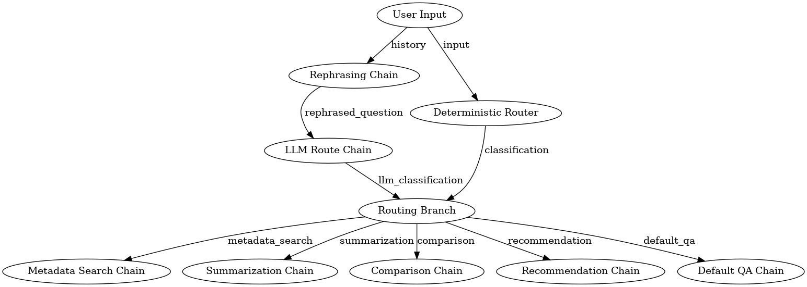

# RFP 문서 기반 RAG 질의응답 시스템 (RagNRoll)

## 🌟 프로젝트 소개

본 프로젝트는 RFP(제안요청서) 문서를 효율적으로 처리하고, 해당 문서의 내용을 기반으로 사용자 질의에 답변하는 **RAG(Retrieval Augmented Generation) 기반의 질의응답 시스템**을 구축합니다. 복잡한 RFP 문서에서 필요한 정보를 신속하게 찾아내고, 정확한 답변을 제공하여 정보 탐색 시간 단축 및 업무 효율성 증대를 목표로 합니다.

## 🔄 프로젝트 RAG 흐름 다이어그램

RFP 문서 기반 RAG 시스템의 전체 동작 과정을 시각적으로 표현한 다이어그램입니다.  
사용자 입력 → 체인 라우팅 → 문서 검색(Retriever) → LLM 응답 생성 → 최종 답변 반환의 흐름을 한눈에 확인할 수 있습니다.

👉 [RAG Flow Diagram 보기](chain_router.png)


## 🚀 주요 기술 스택

*   **Python 3.10+**
*   **Langchain:** RAG 파이프라인 구축
*   **Streamlit:** 웹 기반 사용자 인터페이스 (Web UI) 구현
*   **OpenAI API:** LLM(Large Language Model) 연동
*   **Chroma:** 벡터 데이터베이스 (Vector Database)

## 📁 프로젝트 구조

*   `data/`: 원본 PDF 문서 및 전처리된 데이터 저장
    *   `data/pdf/`: 원본 PDF 파일 보관
    *   `data/image/`: 팀 로고 파일 보관
    *   `data/raw/`: 원본 CSV 파일 보관
*   `src/`: 핵심 소스 코드
    *   `src/app.py`: Streamlit 애플리케이션
    *   `src/chain_router.py`: Langchain 체인 라우팅 로직
    *   `src/chatbot.py`: 챗봇 로직 (Apply for top n)
    *   `src/config.py`: 환경 설정 및 하이퍼파라미터 관리
    *   `src/document.py`: 문서 관련 유틸리티
    *   `src/evaluation.py`: RAG 시스템 평가 로직
    *   `src/main.py`: 메인 실행 파일 (질의응답)
    *   `src/main_vs.py`: 벡터 스토어 생성 및 관리
    *   `src/rag_graph.py`: RAG 그래프 관련 로직
    *   `src/style.py`: Streamlit 스타일링
    *   `src/visualize.py`: 시각화 관련 로직
*   `tests/`: 테스트 코드
*   `requirements.txt`: Python 패키지 의존성 목록
*   `.env`: 환경 변수 (예: API 키) 관리

## 🛠️ 환경 설정 및 설치

1.  **가상 환경 설정:**
    ```bash
    python3 -m venv venv
    source venv/bin/activate
    ```
2.  **의존성 설치:**
    ```bash
    pip install -r requirements.txt
    ```

3.  **환경 변수 설정:**
    `.env` 파일에 필요한 환경 변수들을 아래와 같이 저장합니다.
    ```dotenv
    # OpenAI API Key
    OPENAI_API_KEY='your_openai_api_key'

    # Langchain Smith 설정 (선택 사항: 트레이싱 및 디버깅용)
    LANGCHAIN_API_KEY='lsv2_xxxxxx' # 실제 키로 대체하세요
    LANGCHAIN_PROJECT=rfp_rag_project
    LANGCHAIN_ENDPOINT=https://api.smith.langchain.com/
    LANGCHAIN_TRACING_V2=true

    # Python Path 설정 (프로젝트 루트에서 실행 시 필요)
    PYTHONPATH=./src
    ```
    *위 환경 변수들은 `.env` 파일에 저장하거나, 필요에 따라 직접 `export` 명령어를 통해 설정할 수 있습니다.*
    ```bash
    # 예시: 터미널에서 직접 설정하는 경우
    export PYTHONPATH=./src
    export OPENAI_API_KEY='your_openai_api_key'
    export LANGCHAIN_API_KEY='lsv2_xxxxxx'
    export LANGCHAIN_PROJECT=rfp_rag_project
    export LANGCHAIN_ENDPOINT=https://api.smith.langchain.com/
    export LANGCHAIN_TRACING_V2=true
    ```

4.  **PIP 설치 버전 가져오기:**
    ```bash
    # requirements.txt 파일의 각 줄을 읽어서 처리
    # 주석 (#)과 빈 줄은 건너뜀
    while IFS= read -r line; do
      # 패키지 이름만 추출 (옵션이나 주석 제거)
      pkg_name=$(echo "$line" | awk '{print $1}' | sed 's/#.*//')
      if [ -n "$pkg_name" ]; then
        echo -n "$pkg_name==$(pip show "$pkg_name" | grep "Version" | awk '{print $2}')"
        echo
      fi
    done < requirements.txt
    ```

## 💡 실행 방법

### 1. 벡터 스토어 생성

`data/pdf` 폴더에 100개의 PDF 파일이 준비된 상태에서 벡터 스토어를 생성합니다.
```bash
python src/main_vs.py
```

### 2. 챗봇 터미널 실행
```bash
python src/main.py
```

### 3. 스트림릿 실행방법
```bash
streamlit run src/app.py
```

### 4. 평가함수 실행
```bash
python src/evaluation.py
```

## 📓 협업 & 문서 자료

### 👥 협업일지
- **고인범** 👉 [협업일지 링크](https://www.notion.so/_-27fbc32ff871805cb7f4fd45e413ca14)
- **이종서** 👉 [협업일지 링크](https://www.notion.so/26b64dd7ce72805db00df861d1ad7af2)
- **공지연** 👉 [협업일지 링크](https://chlorinated-knife-ad5.notion.site/26b90068d16d80fc95f1c3774e974ea7)
- **유준영** 👉 [협업일지 링크](https://www.notion.so/26bd8eb5efbb80eb8860cea6e0dac93f)

### 📑 프로젝트 문서
- **프로젝트 노션 페이지**
  👉 [Notion 링크](https://www.notion.so/RFP-RAG-26a7f7b0bee7808e86c9f1b3f9211aa1)

- **최종 보고서 (PDF)**
  👉 [`docs/final_report.pdf`](docs/final_report.pdf) --> 완료 후 수정 필요

- **발표 자료 (PPT)**
  👉 [발표 자료 다운로드](https://your-ppt-link) --> 완료 후 수정 필요
